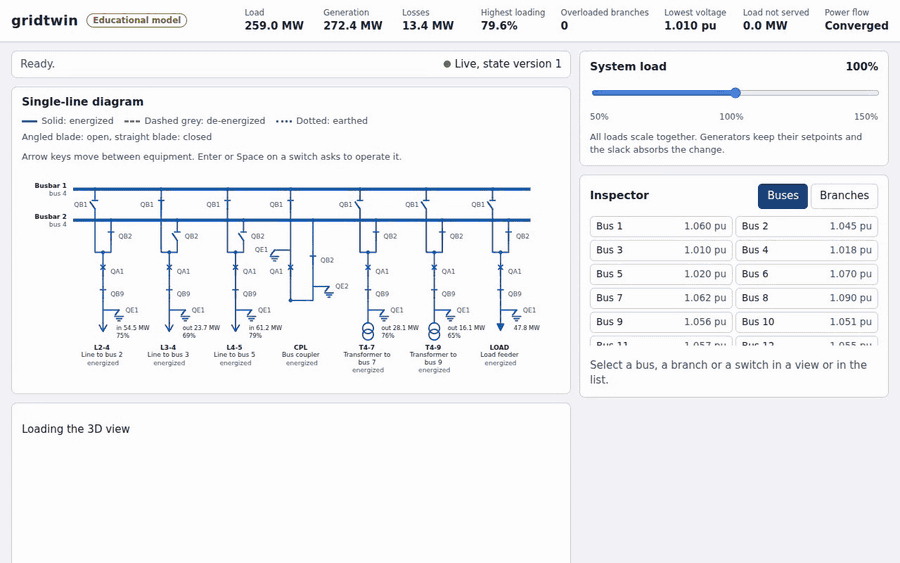
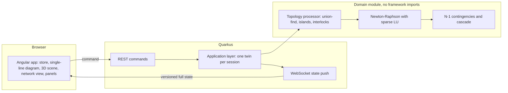

# gridtwin

A digital twin of a small transmission network in the browser: open a breaker in a 3D substation or its single-line diagram and watch an AC power flow redistribute the load, overload a line and, if you keep going, cascade into an outage.



Live demo: [gridtwin.adrianturbinski.pl](https://gridtwin.adrianturbinski.pl/). It runs in one container on my home server, sessions live in memory and the container restarts every hour, so whatever you switched is gone after that.

[](https://github.com/adiyy2001/gridtwin/actions/workflows/ci.yml)

[](LICENSE)

This is an educational model. The networks are the public IEEE 14-bus and IEEE 30-bus test cases, and the substation that replaces bus 4 is made up: two busbars, a bus coupler and six feeder bays. Nothing here describes a real grid, and nothing here is meant for operating one.

## Why I built this

My day job is software that draws single-line diagrams of high-voltage substations: Angular and diagram rendering in the browser, Java 21 and Quarkus behind it. I wanted to model what those drawings mean electrically, so I built the other half. Open a breaker and the solver tells you where the power goes, which line overloads and how an outage spreads.

The project also puts my domain knowledge, numerical methods (a sparse Newton-Raphson solver checked against MATPOWER), a Java back end and a 3D front end in one place.

## What's hard about it

The solver has to agree with MATPOWER to 1e-6 pu in voltage and 1e-4 degrees in angle, and small modelling differences already break that. Where the tap sits on a transformer, whether reactive limits convert all violating generators at once or one at a time, and whether the slack generator is limited all change the third decimal. I generated 16 base case reference solutions and 4 N-1 reference files by running MATPOWER under GNU Octave in Docker, wrote down each convention in [ADR 0004](docs/adr/0004-newton-raphson-modelling-choices.md) and compared everything number by number. The worst deviation over all of it is in the validation section below.

A breaker can cut the network in two. When it does, one half may have no generator, so it has no voltage reference and no meaning for a power flow. The topology processor merges nodes with union-find, finds the islands, picks a slack for each energized one and marks the rest as de-energized with their load shed ([ADR 0005](docs/adr/0005-topology-processor-rules.md)). An island whose Newton iteration diverges is reported as a voltage collapse and the other islands still solve.

A warm start can land on the wrong answer. The power flow equations have a second, low-voltage root near 0.4 pu, and a property test on random stressed networks found a warm start settling on it (restoring a branch from the solution of its outage). A solution below 0.5 pu now triggers a second run from a flat start. The same property tests showed that opening and closing a breaker did not always return the original state to 1e-9 at the solver tolerance of 1e-8, so the twin solves to 1e-10.

Interlocks need a notion of a live section. A disconnector may only move while its breaker is open, and an earthing switch may only close on a de-energized section. A line whose breaker is open can still be fed from its far end, so earthing it has to be refused even though nothing near the switch is energized. Refusals come back with a code and a sentence that the UI shows.

Three views of one state have to stay in sync, and the 3D one is the least accessible. Selection, hover and every operation live in one store. The diagram and the inspector are fully keyboard operable with visible focus and an announcer for refusals, and the 3D scene is an enhancement on top. The scene exposes a `describe()` hook so the end-to-end tests can check what it shows without reading pixels.

## How it works



A command arrives over REST. The session applies it, and the interlocks run first. The topology processor turns switch positions into a bus-branch model, the power flow solves every energized island, the version counter goes up and the full state is pushed over the WebSocket. N-1 and cascade runs start from the same state and return their own results, which the UI previews or replays without solving again.

The power flow is Newton-Raphson in polar form. With $Y = G + jB$ and $\theta_{ik} = \theta_i - \theta_k$, the injections are

$$P_i = V_i \sum_k V_k \left( G_{ik} \cos\theta_{ik} + B_{ik} \sin\theta_{ik} \right), \qquad Q_i = V_i \sum_k V_k \left( G_{ik} \sin\theta_{ik} - B_{ik} \cos\theta_{ik} \right)$$

and every iteration solves $J \, \Delta x = \Delta F$ with an analytic sparse Jacobian until the largest mismatch is at most $10^{-8}$ pu. Branches are pi circuits with an off-nominal tap and a phase shift. [docs/physics.md](docs/physics.md) has all the equations, the topology rules, the severity index and the cascade rules, with sources.

## Validation and benchmarks

Every number below comes from a script in this repository and was produced on the machine described here. The result files are in [bench/results](bench/results).

Hardware: 12th Gen Intel Core i7-12700H (20 logical cores), 15 GB of memory, Linux 6.6 under WSL2, OpenJDK 21.0.12. For the browser: Chromium 148 in headless mode, once with the SwiftShader software renderer and once on the integrated Intel Iris Xe GPU through the WSL2 Direct3D 12 layer. The GPU runs were repeated natively on Windows 11 on the same laptop, on mains power, with headless Chrome 154 on the Iris Xe through Direct3D 11 (the panel is 1920x1080 at 165 Hz). The server stayed in WSL2 for those runs and Chrome reached it through the WSL2 localhost forwarding. Other builds were running on the machine at the same time, so the tails of the timings are noisy.

### Accuracy against MATPOWER

`tools/validation-report.sh` compares the solver with MATPOWER 8.1 (run under GNU Octave 11.3.0): IEEE 14 and IEEE 30 at load factors 0.5, 1.0, 1.2 and 1.5, with and without reactive limits, plus every N-1 outage that MATPOWER solves (25, 24, 47 and 46 outages in the four files). The worst deviation over all compared quantities:

| Quantity | Worst deviation | Limit in the tests |
| --- | --- | --- |
| Voltage magnitude | 8.23e-9 pu | 1e-6 pu |
| Voltage angle | 4.06e-7 degrees | 1e-4 degrees |
| Branch active and reactive power | 9.01e-7 MW | 1e-2 MW |

### Solver and contingency timings

`tools/bench.sh java` runs 300 warm-up and 300 measured iterations per case. My targets are an IEEE 30 solve under 10 ms and an IEEE 30 N-1 run under 500 ms. Both are met with a wide margin.

| Measurement | Median ms | p95 ms |
| --- | --- | --- |
| IEEE 14 solve, flat start | 0.23 | 0.69 |
| IEEE 30 solve, flat start | 0.67 | 0.93 |
| IEEE 30 solve, warm start | 0.55 | 0.79 |
| IEEE 14 N-1, 25 outages, sequential | 5.70 | 7.02 |
| IEEE 14 N-1, 20 threads | 3.00 | 4.17 |
| IEEE 30 N-1, 47 outages, sequential | 41.3 | 45.5 |
| IEEE 30 N-1, 2 threads | 26.6 | 30.0 |
| IEEE 30 N-1, 8 threads | 10.2 | 13.2 |
| IEEE 30 N-1, 20 threads | 8.22 | 11.0 |
| IEEE 14 cascade from the outage of L2-4 | 1.58 | 1.81 |

### Front end

`tools/bench.sh web` and `tools/bench.sh web --gpu` drive the production build with Playwright. Command to rendered frame is the time from the confirm click to the second animation frame after the new state is applied, including the server round trip.

| Command to rendered frame | Median ms | p95 ms |
| --- | --- | --- |
| Software renderer, with the 3D scene | 61.7 | 206.5 |
| Without WebGL, diagram and network view only | 43.8 | 44.5 |
| Integrated GPU through WSL2, with the 3D scene | 44.5 | 45.2 |
| Integrated GPU on native Windows, with the 3D scene | 25.5 | 54.7 |

The target of under 100 ms holds on the GPU and without the scene. On native Windows the round trip also crosses the WSL2 network bridge, which is where the spread in the tail comes from. The software renderer needs about 200 ms for a 1080p frame, so it misses the target in the tail.

The target is 60 fps at 1080p on an integrated GPU. The scene is rendered on demand, so it costs nothing while idle. To measure the worst case the benchmark orbits the camera at 1920x1080 and renders every animation frame for three runs of 10 seconds after a 3 second warm-up.

On native Windows the Iris Xe meets the target with room to spare. The three runs gave 165.0, 165.0 and 164.8 fps, which is the refresh rate of the panel, with a median frame of 6.1 ms, a p95 of 6.2 ms and none of the 4951 frames dropped. Timer queries put the GPU time at 2.2 ms per frame for 16 draw calls and 16196 triangles. The three controls (a blank page, the application with an idle scene and an empty WebGL canvas) run at the same 165 fps.

Under WSL2 the same GPU does not reach the target. Through the WSL2 Direct3D 12 layer the runs gave 46.5, 52.2 and 46.7 fps, the median frame was 16.7 ms (one refresh at 60 Hz) and 346 of 1459 frames (24%) took two refreshes, with a GPU time of 6.5 ms per frame. The controls held 60.0 fps there and dropped at most one frame in 600, before and after the scene runs, so the slip came from the scene running on that layer. At 1280x720 the GPU time was 3.8 ms and the average went up to 55 to 59 fps. Before I had the native number I tried the usual levers. Rebuilding the shadow map only when the content changes or a blade moves took about 1 ms off the GPU time, and a Lambert material on the ground took another 1.9 ms, from 10.2 ms to between 6.5 and 7.4 ms over several runs. Switching multisampling off saves about 1.5 ms more, and Lambert materials everywhere with no multisampling reached 4.9 ms and 54 to 56 fps. That gave up the metal and porcelain look and was still short of 60, so I kept the physically based materials and the multisampling. The native run confirms that the rest was the WSL2 presentation path and not the scene. Software rendering gives about 5 fps, which is why that number says little without a GPU.

`tools/bench.sh web --gpu` reproduces the WSL2 or Linux numbers. For the Windows numbers I ran the server in WSL2 and the two scripts with Windows Node and Playwright: `node bench/web/fps.ts --gpu` and `node bench/web/command-latency.ts --gpu` with `CHROME_PATH` set to the Windows `chrome.exe` and `GRIDTWIN_BASE_URL=http://localhost:18480`. The results are in `bench/results/*-gpu-windows.json`.

The initial bundle is 338 kB raw (93 kB transferred). The 3D scene is a lazy chunk of 620 kB (131 kB transferred), loaded after the first paint.

## Run it locally

With Docker:

```
git clone https://github.com/adiyy2001/gridtwin.git && cd gridtwin
docker compose up --build
```

Then open http://127.0.0.1:18400. The compose service binds to the loopback interface only.

Without Docker you need Java 21, Node 24.15 or newer (the repository pins 24.21 in `.nvmrc`) and pnpm 11 (`corepack enable` is enough for pnpm):

```
tools/build-all.sh
java -jar api/target/quarkus-app/quarkus-run.jar
```

The application then listens on http://127.0.0.1:18480.

A good first minute: open the bus coupler in the diagram, select the line that turns red, run N-1, click a row to preview that outage, then run the cascade from L2-4 and drag the scrubber.

## Tests

| What | How it is checked |
| --- | --- |
| Admittance matrix and Jacobian | a hand-computed 3-bus example, and every Jacobian entry against a central finite difference, including a network with a tap and a phase shift |
| Topology processor | an open coupler splits a bus, an earthing switch on a live section is refused, islands and the slack rule |
| Solver | MATPOWER references for both cases, four load factors and two reactive limit modes, and for every solved N-1 outage |
| Properties | generation equals load plus losses to 1e-6 pu on random networks, opening and closing a breaker returns the original solution to 1e-9, parallel contingency analysis equals sequential, all from a small harness of my own (ADR 0008) |
| REST and WebSocket | Quarkus integration tests, plus ArchUnit rules that keep framework imports out of the domain |
| End to end | 21 Cypress tests against the production jar, among them opening a line breaker in the diagram and seeing the line de-energized in both views while the parallel paths take more load |
| 3D scene | Playwright screenshots in five states that I reviewed by eye, with checks that frames are not blank and that every state differs |
| Accessibility | axe on six scenarios (no serious or critical violations) and Lighthouse (accessibility score 100) |

Line coverage from `node tools/coverage-badge.ts`, which reads the JaCoCo and Vitest reports: domain 99.0%, api 88.5%, cases 88.2%, bench 96.9%, web 98.2%, all together 97.5%. The build enforces 90% on the domain and 80% elsewhere, and 90% on the web logic files.

```
./mvnw -B -ntp verify
node --test "tools/**/*.test.ts" && node tools/check-style.ts
pnpm install --frozen-lockfile && pnpm run typecheck:scripts && pnpm run lint:scripts && pnpm --dir e2e run typecheck
pnpm --dir web run lint && pnpm --dir web run typecheck && pnpm --dir web run test:ci
tools/build-all.sh && pnpm --dir e2e run cypress:ci
pnpm --dir e2e run a11y && pnpm --dir e2e run visual && pnpm --dir e2e run lighthouse
```

The MATPOWER references can be regenerated with `tools/reference/run.sh all`, and `tools/reference/run.sh --check all` fails if the committed files differ. It needs Docker and a 5.7 GB Octave image. The GitHub Actions workflow runs the same commands, and the reference check only when the reference inputs change.

## Design decisions

The decisions are recorded as ADRs in [docs/adr](docs/adr/README.md). These are the ones I would start with:

- [0002](docs/adr/0002-hexagonal-back-end-with-a-framework-free-domain.md): the domain module has no framework imports, and an ArchUnit test enforces it.
- [0003](docs/adr/0003-sparse-linear-algebra-with-ejml.md): EJML's sparse LU behind a port, and what it lacks.
- [0004](docs/adr/0004-newton-raphson-modelling-choices.md): the solver conventions that make it match MATPOWER.
- [0005](docs/adr/0005-topology-processor-rules.md): energization, slack and interlock rules.
- [0006](docs/adr/0006-case-data-and-synthetic-parameters.md): where the data comes from and which parameters are invented.
- [0008](docs/adr/0008-property-tests-with-an-own-harness.md): a small property test harness instead of jqwik.
- [0009](docs/adr/0009-contingencies-on-a-fork-join-pool.md): a fork-join pool, because virtual threads do not speed up CPU-bound work.
- [0010](docs/adr/0010-one-twin-per-session-and-full-state-push.md): one twin per session and a full state push.
- [0017](docs/adr/0017-severity-index-and-contingency-ranking.md) and [0018](docs/adr/0018-cascade-simulation-is-an-educational-simplification.md): the severity index and the cascade rules.
- [0021](docs/adr/0021-single-line-diagram-layout-and-symbols.md): a hand-written SVG renderer for the diagram.
- [0023](docs/adr/0023-procedural-3d-substation-scene.md): a procedural 3D scene.

## Limitations and what I would do next

- It is a steady-state, balanced model. There are no dynamics, no short-circuit calculations and no synchronism check when two live islands are joined.
- The cascade is a static simplification. A branch trips the instant it passes 120% of its rating, with no protection timing, frequency or voltage dynamics. It shows an order in which overloads could spread. It does not predict anything about a real grid.
- The thermal ratings are synthetic (125% of the base case flow, rounded up to a multiple of 5 MVA, at least 20 MVA), the IEEE 14 voltage levels are invented and the substation is fictional.
- EJML has no fill-reducing ordering. That is irrelevant at 22 and 53 unknowns and would matter for a network with thousands of buses.
- The web application offers IEEE 14 only. IEEE 30 is solved, validated and benchmarked, but it has no substation and no entry in the UI. The other stretch goals are not built either: a fast decoupled power flow and state estimation ([ADR 0027](docs/adr/0027-stretch-goals-not-built.md)).
- Reactive limits do not release again. A generator that hit its limit at 150% load stays a PQ bus for that solve.
- The 60 fps target holds on the Iris Xe under native Windows (165 fps at 1080p, no dropped frames) but not through the WSL2 Direct3D 12 layer (46 to 52 fps, 24% of the frames slipping), as described above. I have not measured it on macOS or on a native Linux driver. The 3D scene has no pixel baselines, because they differ between GPUs and drivers.
- Equipment cannot be operated by keyboard inside the 3D canvas. The canvas takes arrow keys for panning and plus and minus for zoom, and everything is operable in the diagram and the inspector.
- Sessions live in memory and there is no authentication, so it is a demo and not a service.
- The property tests use a small harness of my own and not jqwik. I explain why in ADR 0008 and swapping it in would be mechanical.

Next I would build the second substation for IEEE 30 with a selector, then the fast decoupled solver with an accuracy and speed comparison, and then state estimation from noisy measurements.

## Credits and license

MIT, see [LICENSE](LICENSE). The IEEE test case data comes from the University of Washington Power Systems Test Case Archive through MATPOWER 8.1, and the reference solutions come from MATPOWER and GNU Octave. [CREDITS.md](CREDITS.md) lists every library, data set and tool with its license.
